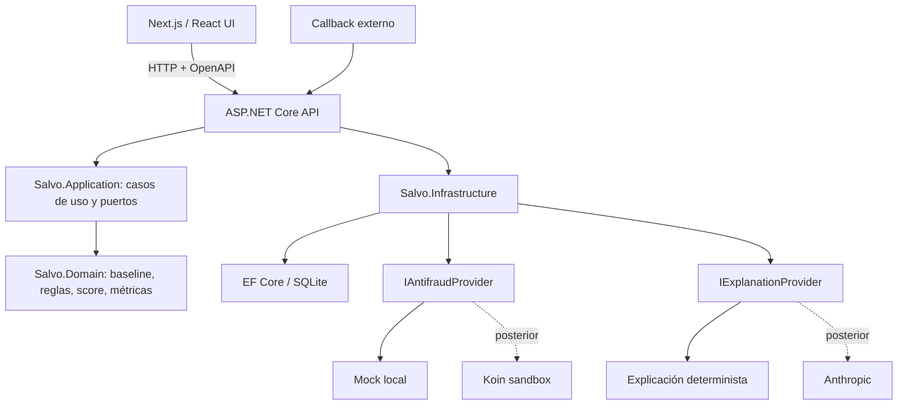

# Salvo — Blueprint del MVP

> Estado del documento: vigente
> Estado del proyecto: Etapa 2 integrada y verificada; Etapa 3 pendiente de autorización
> Última actualización: 2026-08-31
> Seguimiento operativo: [[Salvo-Progress]]

Fuente de verdad del producto, alcance y arquitectura. Salvo es una consola antifraude B2B para un
comercio electrónico. El MVP usa un proveedor externo mock; Koin sandbox y Anthropic se difieren
hasta que el núcleo local funcione y se apruebe cada integración.

## Navegación rápida

- [[#1. Objetivo del MVP|Objetivo]]
- [[#2. Alcance aprobado|Alcance]]
- [[#4. Requisitos funcionales|Requisitos funcionales]]
- [[#5. Alineación con Koin|Alineación con Koin]]
- [[#6. Arquitectura|Arquitectura]]
- [[#7. Modelo de datos conceptual|Modelo de datos]]
- [[#10. Seguridad y privacidad|Seguridad]]
- [[#11. Etapas pequeñas y verificables|Etapas]]
- [[#13. Bitácora de decisiones|Bitácora]]

## 0. Cómo usar este documento

Este Blueprint define el alcance, las decisiones y las etapas verificables. No es un archivo de
instrucciones para el agente: las reglas permanentes de Codex viven en `AGENTS.md` en la raíz.

Cuando cambie una decisión:

1. actualizar la bitácora de este archivo;
2. actualizar los documentos derivados que hayan quedado desfasados;
3. ajustar `AGENTS.md` solo si cambia una regla permanente de implementación.

## 1. Objetivo del MVP

Salvo es una consola de operaciones antifraude para un comercio electrónico. Recibe pedidos
sintéticos o importados, calcula un riesgo local mediante reglas deterministas y auditables,
genera alertas para los casos sospechosos y permite que un analista marque el pedido como legítimo
o fraude. Un dashboard resume el riesgo y una evaluación reproducible mide precisión, recall y F1.

El proyecto existe como demostración de portfolio para una oportunidad profesional vinculada con
Koin. Por eso prioriza problemas reales de integración antifraude: contratos de datos, estados
asíncronos, correlación por identificadores, idempotencia, callbacks, reconciliación, seguridad y
degradación elegante.

### Principio rector

El `localRiskScore` lo calculan reglas deterministas. La IA no decide si un pedido es fraude y una
evaluación de Koin, si se habilita, se guarda como una fuente externa separada. Nunca se mezclan los
scores ni se presenta uno como si fuera el otro.

### Pitch breve

> Salvo es una consola antifraude para e-commerce. Puntúa pedidos con reglas explicables, administra
> alertas y su ciclo de revisión y demuestra una integración desacoplada con un proveedor externo.
> Funciona completamente con datos sintéticos y un simulador local; Anthropic y el sandbox de Koin
> son adaptadores opcionales, no dependencias del núcleo.

## 2. Alcance aprobado

### Incluido en el MVP

- Dataset sintético e-commerce, reproducible y etiquetado.
- Importación de pedidos normalizados mediante CSV o JSON.
- Baseline cronológico por comercio/comprador pseudónimo.
- Motor de reglas puro con señales legibles y configuración auditable.
- `localRiskScore` de 0 a 100 y umbral configurable.
- Alertas idempotentes y revisión transaccional.
- Feed, detalle y dashboard antifraude.
- Matriz de confusión, precisión, recall, F1, tasa de falsos positivos y barrido de umbral.
- Interfaz `IAntifraudProvider` con implementación `mock` local.
- Escenarios externos simulados: `approved`, `denied` y `received`.
- Persistencia de correlación y callback simulado idempotente.
- Tests unitarios y de integración sin red.
- README de portfolio con decisiones, métricas, arquitectura y guion de demo.

### Diferido hasta después del núcleo

- Anthropic para redactar explicaciones; el MVP inicial usa explicación determinista/mock.
- Cliente real del sandbox de Koin.
- Device fingerprint oficial de Koin.
- Callback público en Internet.
- Autenticación y multi-tenant real.
- Prometheus, Grafana y alertas operativas.
- PostgreSQL, despliegue y CI remoto.
- Consulta en lenguaje natural o NL→SQL.

### Fuera de alcance

- Pagos, captura o autorización reales.
- Datos personales o financieros reales.
- PAN, CVV, documentos de identidad o enlaces sensibles persistidos o registrados.
- Certificación/UAT o afirmaciones de integración oficial con Koin.
- Decisiones automáticas que bloqueen dinero o entrega de bienes reales.
- Modelos de machine learning entrenados.
- Tiempo real o streaming.

## 3. Usuario y flujo principal

### Persona

Analista de riesgo u operaciones de un comercio electrónico ficticio.

### Flujo

1. El analista carga el dataset demo o importa pedidos.
2. Salvo procesa los pedidos en orden temporal.
3. Para cada pedido calcula el baseline usando únicamente historia anterior.
4. Las reglas generan señales y `localRiskScore`.
5. Los pedidos que superan el umbral producen una alerta una sola vez.
6. El analista inspecciona señales y contexto.
7. El analista confirma que el pedido es legítimo o reporta fraude.
8. El dashboard y las métricas se actualizan.
9. Opcionalmente se ejecuta el proveedor externo mock para demostrar estados y callbacks.

## 4. Requisitos funcionales

### 4.1 Datos e importación

- Seed idempotente con 300 pedidos de una ventana fija de 120 días.
- Ground truth completo: 300 etiquetas separadas, con 18 fraudes y 282 casos legítimos.
- Campos mínimos normalizados:
  - `occurredAt` en UTC;
  - `amountCents` positivo para el total del pedido;
  - `currencyCode` ISO 4217;
  - `merchantId` y `merchantReferenceId` forman una referencia comercial estable y única;
  - `buyerReferenceId` pseudónimo;
  - `countryCode` ISO 3166-1 alpha-2;
  - `city`, `channel` y `deviceSessionId` opcionales.
- El parser acumula errores por fila y continúa.
- Una biblioteca mantenida de .NET resuelve quoting, BOM y delimitadores; la API valida los DTOs
  y el dominio vuelve a comprobar sus invariantes. El frontend valida anticipadamente solo para UX.

Contrato detallado aprobado para E2:

- `Order` contiene hechos inmutables; score, estado, evaluaciones y alertas se difieren.
- PK técnica `id`; unicidad natural sobre `(merchantId, merchantReferenceId)`.
- Repetir una referencia con el mismo contenido se omite; con contenido distinto produce conflicto.
- IDs sintéticos ASCII, en mayúsculas, de hasta 64 caracteres y con prefijos `MER_`, `ORD_`,
  `BUY_` y `DEV_` según corresponda.
- `occurredAt` y `createdAt` son `DateTimeOffset` en C#, se normalizan a UTC y se persisten como
  texto ISO 8601 canónico de longitud fija.
- El orden total es `occurredAt`, `merchantId`, `merchantReferenceId`.
- `amountCents` es `Int64` entre 1 y 1.000.000.000.000; el MVP admite `UYU`, `BRL` y `USD` sin
  conversión FX. Los historiales monetarios futuros se particionan por moneda.
- `channel` es nullable y admite `WEB`, `MOBILE_APP` o `MARKETPLACE`.
- `city` es nullable, máximo 80 caracteres, Unicode NFC, sin controles ni direcciones.
- No se persiste `description`; los campos desconocidos se rechazan.
- CSV y JSON comparten el mismo DTO normalizado mediante `POST /api/order-imports`, archivo
  `multipart/form-data` y formato explícito `CSV | JSON`.
- Límite de 5 MiB y 10.000 registros; CSV UTF-8 con BOM opcional, coma o punto y coma y quoting
  RFC 4180; JSON como array de objetos.
- Los registros válidos se escriben en una transacción; los inválidos se reportan por registro y
  no bloquean el resto. Un fallo de infraestructura revierte todo el subconjunto válido.
- Los errores usan códigos estables, no reproducen valores recibidos y detallan como máximo 1.000
  errores sin perder los conteos completos.

### 4.2 Baseline y scoring local

- Cada pedido solo puede observar pedidos anteriores.
- Estadísticas de importe sobre valores positivos del pedido.
- País habitual, comercios/compradores conocidos, frecuencia y horas habituales.
- Cold start: las reglas que dependen de historial no disparan antes de un mínimo configurable.
- Reglas iniciales:
  - `amount_anomaly`;
  - `velocity`;
  - `cross_border_velocity`;
  - `unusual_hour` usando una zona horaria de negocio explícita;
  - `new_buyer_high_value`;
  - `foreign_country`.
- Cada señal tiene `{ rule, weight, detail }` y `detail` es legible para una persona.
- Pesos, ventanas, mínimos y umbral viven en un `RuleConfig` central e inmutable.
- Reejecutar scoring produce el mismo resultado y no altera pedidos ya revisados sin una operación
  explícita de recalibración.

### 4.3 Alertas y revisión

- Una alerta por evaluación local marcada.
- `severity` se deriva del score mediante una función determinista y no se duplica en la base salvo
  que se decida guardarla como snapshot.
- Estados de alerta: `OPEN`, `CONFIRMED_SAFE`, `REPORTED_FRAUD`.
- La revisión actualiza alerta y pedido en una única transacción de base de datos.
- El score copiado a la alerta es un snapshot auditable de la evaluación que la originó.
- La métrica `amountAtRisk` suma alertas abiertas; el fraude ya reportado se presenta por separado.

### 4.4 Interfaz

- `/import`: carga demo o importa un archivo y presenta errores por fila.
- `/alerts`: feed de alertas abiertas ordenadas por score.
- `/alerts/[id]`: contexto, señales, score y acciones de revisión.
- `/dashboard`: alertas abiertas, monto en riesgo, fraude reportado, tasa de flags, riesgo temporal y
  señales principales.
- Severidad expresada con texto además de color.
- Estados vacíos, carga y error accesibles.

### 4.5 Evaluación

- Ground truth disponible solo en fixtures/seed y excluido de todas las features.
- Matriz TP/FP/FN/TN.
- Precisión, recall, F1 y tasa de falsos positivos.
- Barrido de umbral sobre scores ya calculados.
- Las métricas se calculan sobre procesamiento temporal válido; nunca usando un baseline construido
  con el futuro.

## 5. Alineación con Koin

Koin evalúa transacciones de comercios, no entrega movimientos bancarios de consumidores. Su flujo
publicado contempla pre-evaluación opcional, evaluación completa, estados síncronos y resultados
asíncronos mediante callback. La credencial privada y el identificador de organización se obtienen
durante onboarding.

### 5.1 Lo que demuestra el MVP sin afirmar integración oficial

- Contrato de proveedor externo detrás de una interfaz.
- `referenceId` estable por pedido.
- `externalEvaluationId` para correlación.
- Estados externos separados: `PENDING`, `APPROVED`, `DENIED`, `ERROR`.
- Respuesta `received` tratada como pendiente.
- Callback idempotente y replay-safe.
- Reconciliación simulada mediante consulta de estado.
- Timeout y error de proveedor sin perder la evaluación local.
- Datos sintéticos y payloads sanitizados en logs.

### 5.2 Adaptadores

```csharp
public interface IAntifraudProvider
{
    Task<ExternalEvaluationResult> EvaluateAsync(
        ExternalEvaluationInput input,
        CancellationToken cancellationToken);

    Task<ExternalEvaluationResult> GetStatusAsync(
        string externalEvaluationId,
        CancellationToken cancellationToken);
}
```

- `MockAntifraudProvider`: obligatorio en el MVP, determinista y sin red.
- `KoinSandboxProvider`: posterior y activado solo si existen credenciales y contrato verificado.

El adaptador real deberá consultar el OpenAPI vigente. No se copiarán tipos manualmente desde
ejemplos narrativos si difieren del contrato publicado.

### 5.3 Requisitos antes de activar sandbox

- Private key y `org_id` facilitados por Koin.
- Base URL sandbox confirmada.
- Payload completo exigido por la versión elegida.
- Callback HTTPS públicamente accesible.
- Verificación del mecanismo oficial de autenticación/origen del callback.
- Device fingerprint oficial cuando el flujo web lo requiera.
- Casos sandbox de aprobación, rechazo y pendiente.
- Política de timeout, retry, backoff y reconciliación.

## 6. Arquitectura

Backend monolítico modular en ASP.NET Core y cliente web en Next.js. El backend concentra dominio,
casos de uso, persistencia e integraciones; Next.js es la capa de presentación y consume un contrato
HTTP/OpenAPI. No se crean microservicios para el MVP.



### Capas

- `backend/src/Salvo.Domain/`: entidades, value objects, reglas, scoring y métricas puras.
- `backend/src/Salvo.Application/`: casos de uso, puertos y contratos internos.
- `backend/src/Salvo.Infrastructure/`: EF Core, repositorios y adaptadores mock/externos.
- `backend/src/Salvo.Api/`: endpoints HTTP, validación de transporte, OpenAPI y composición.
- `backend/tests/`: tests unitarios, de aplicación e integración.
- `frontend/src/`: App Router, componentes, cliente API y validación de UX.

`Salvo.Domain` no referencia ASP.NET Core, EF Core ni SDKs externos. La UI no contiene reglas de
fraude y no accede a la base de datos. Los endpoints delegan en casos de uso y los adaptadores no
filtran tipos o errores específicos del proveedor fuera de infraestructura.

## 7. Modelo de datos conceptual

### Order

- `id`: GUID interno y PK técnica
- `merchantId`
- `merchantReferenceId`; único dentro de `merchantId`
- `buyerReferenceId` pseudónimo
- `occurredAt`
- `amountCents`
- `currencyCode`
- `countryCode`, `city`, `channel`, `deviceSessionId`
- `createdAt`

Los hechos del pedido son inmutables. `localRiskScore`, estados, evaluaciones y alertas no se
preasignan como columnas nullable en E2; se incorporan cuando existan sus casos de uso y migraciones.

### OrderEvaluationLabel

- `orderId`: PK y FK a `Order`
- `isFraudLabel`
- `createdAt`

La etiqueta es ground truth exclusivo de demo/evaluación. No forma parte de `Order`, no aparece en
los contratos públicos CSV/JSON y solo el seed interno puede escribirla. El motor de scoring no la
recibe como feature.

### RiskEvaluation

- `id`
- `orderId`
- `source`: `LOCAL | EXTERNAL_MOCK | KOIN_SANDBOX`
- `score` nullable para proveedores que no lo devuelvan
- `status`: `PENDING | APPROVED | DENIED | ERROR`
- `signalsJson` solo para evaluación local
- `externalEvaluationId` nullable
- `errorCode` sanitizado nullable
- timestamps

### Alert

- `id`
- `orderId`
- `riskEvaluationId` único
- `riskScoreSnapshot`
- `signalsJsonSnapshot`
- `status`: `OPEN | CONFIRMED_SAFE | REPORTED_FRAUD`
- `explanation`
- `recommendedAction`
- `explanationStatus`: `NOT_REQUESTED | PENDING | READY | FAILED`
- timestamps

### CallbackReceipt

- `id`
- `provider`
- `deduplicationKey` único o hash estable
- `externalEvaluationId`
- `receivedAt`
- `processedAt`
- `status`

No se persiste el payload externo completo si contiene PII. Para debug se usan fixtures sintéticos
y logs redactados.

## 8. Stack y política de versiones

| Área | Elección |
| --- | --- |
| Backend | .NET 10 LTS + C# 14 + ASP.NET Core |
| Frontend | Node.js 24.20.0 + npm 11.19.0 + Next.js App Router + React |
| Lenguaje UI | TypeScript estricto |
| UI | Tailwind CSS |
| Persistencia | EF Core + SQLite local |
| Contrato HTTP | OpenAPI generado por ASP.NET Core; cliente TypeScript tipado |
| Validación | DTOs y dominio en .NET; Zod solo en bordes de UI que lo requieran |
| Tests backend | xUnit + tests de integración ASP.NET Core |
| Tests frontend | Vitest + Testing Library |
| Gráficos | Recharts |
| CSV | biblioteca .NET mantenida + validación autoritativa; no parser manual |
| IA posterior | cliente server-side detrás de `IExplanationProvider` |
| Koin posterior | `HttpClient` tipado detrás de `IAntifraudProvider` |

Reglas de versionado:

- `global.json` fija el SDK exacto de .NET 10 validado en la Etapa 1.
- Los proyectos usan `net10.0`, nullable habilitado y warnings tratados como errores.
- Los paquetes NuGet se fijan en `Directory.Packages.props` sin versiones flotantes.
- `.nvmrc` fija Node 24.20.0.
- `package-lock.json` se versiona.
- Las dependencias npm usan versiones exactas; no se usan rangos `latest` en instrucciones
  reproducibles.
- Las versiones exactas de Next.js, EF Core y demás paquetes se confirman en la Etapa 1 mediante
  smoke tests de ambas toolchains.
- El script de lint usa ESLint directamente, no `next lint`.
- Antes de escribir frontend se consulta la guía incluida en `node_modules/next/dist/docs/` para
  la versión instalada.

## 9. Variables de entorno y servicios

### Núcleo local

```dotenv
ASPNETCORE_URLS="http://127.0.0.1:5100"
ConnectionStrings__SalvoDb="Data Source=salvo.db"
SALVO_API_BASE_URL="http://127.0.0.1:5100"
BUSINESS_TIMEZONE="America/Montevideo"
```

### IA posterior

```dotenv
AI_PROVIDER="mock"
ANTHROPIC_API_KEY=""
ANTHROPIC_MODEL="claude-sonnet-5"
```

### Koin posterior

```dotenv
KOIN_MODE="mock"
KOIN_BASE_URL="https://api-sandbox.koin.com.br"
KOIN_PRIVATE_KEY=""
KOIN_ORG_ID=""
KOIN_STORE_CODE=""
KOIN_CALLBACK_URL=""
```

`.env.example` contiene nombres y valores seguros. `.env` nunca se versiona. Ninguna clave usa
prefijo `NEXT_PUBLIC_`.

Servicios/cuentas:

- Núcleo: ninguno externo.
- Anthropic: cuenta de API y límite de gasto, cuando se active.
- Koin: onboarding y credenciales sandbox, cuando se active.
- Callback Koin: despliegue o túnel HTTPS, solo en la etapa sandbox.
- Docker: solo para observabilidad post-MVP.

## 10. Seguridad y privacidad

- Datos 100% sintéticos durante el MVP.
- La API valida DTOs y el dominio valida invariantes; el frontend no sustituye esa validación.
- Secretos solo en el backend ASP.NET Core; Next.js no recibe claves de proveedores.
- Nunca registrar bodies completos de proveedor por defecto.
- No almacenar PAN, CVV ni documentos reales.
- Identificadores de comprador pseudónimos.
- Callbacks persistidos antes de responder `2xx` e idempotentes ante replay.
- Timeouts de red y errores sanitizados.
- La caída de IA o Koin no impide el scoring local.
- Sin autenticación, la app es solo local y no se publica con rutas mutables abiertas.
- Antes de datos reales o sandbox se revisan LGPD, retención, redacción y origen de callbacks.

## 11. Etapas pequeñas y verificables

### Etapa 0 — Documentación e instrucciones

- Normalizar documentos y crear `AGENTS.md`.
- No escribir código de aplicación.

Verificación: una sola fuente de verdad, sin contradicciones bloqueantes y sin código de aplicación
versionado.

### Etapa 1 — Fundaciones reproducibles

- Fijar SDK .NET, Node y dependencias exactas.
- Crear la solución con Domain, Application, Infrastructure, API y tests.
- Configurar ASP.NET Core, OpenAPI, EF Core/SQLite y un smoke test de persistencia.
- Crear el frontend Next.js sin mover ni borrar `DesignAgent/`.
- Configurar TypeScript, ESLint, Vitest y una prueba de UI.
- Añadir una compuerta local que ejecute verificaciones backend y frontend.

Verificación: API y frontend arrancan; `dotnet build`, `dotnet test`, `npm run check` y los builds
de producción pasan; smoke test EF Core/SQLite verde.

### Etapa 2 — Contrato y datos

- Implementar entidades, configuraciones EF Core, migración, fixtures y seed idempotente.
- Implementar importación en el backend con validación autoritativa y errores parciales.

Verificación: dos seeds dejan el mismo conteo; parser cubre quoting y errores parciales.

### Etapa 3 — Motor determinista

- Baseline temporal, reglas y score.
- Evaluación temprana y calibración.

Verificación: tests por regla y métricas reproducibles sin fuga temporal.

### Etapa 4 — Alertas y casos de uso

- Persistencia de evaluaciones.
- Alertas idempotentes.
- Revisión transaccional.

Verificación: reintentos no duplican y los estados permanecen consistentes.

### Etapa 5 — UI y dashboard

- Implementar en Next.js importación, feed, detalle, revisión y dashboard consumiendo la API.

Verificación: recorrido completo con datos, sin datos y con errores.

### Etapa 6 — Proveedor antifraude mock

- Interfaz, escenarios `approved/denied/received`, callback y reconciliación simulados.

Verificación: callbacks duplicados no repiten efectos y el estado pendiente puede finalizar.

### Etapa 7 — Explicabilidad

- Primero proveedor determinista.
- Después, si se aprueba, adaptador Anthropic con salida estructurada, grounding y mocks de test.

Verificación: el sistema funciona sin key; la suite nunca depende de red.

### Etapa 8 — Calidad y portfolio

- Métricas finales, README, diagramas, capturas y guion de demo.

Verificación: instalación desde cero, compuertas .NET y npm verdes y demo reproducible.

### Post-MVP — Koin sandbox, auth, observabilidad y deploy

Cada capacidad se aprueba por separado. Activar el sandbox nunca es una condición para considerar
completo el MVP local.

## 12. Criterios globales de aceptación

- El motor local es determinista y auditable.
- No hay fuga temporal en baseline o evaluación.
- El seed y los efectos externos simulados son idempotentes.
- Scores local y externo permanecen separados.
- La app funciona sin Anthropic y sin Koin.
- No hay secretos ni PII real en repo, DB, fixtures o logs.
- Todas las mutaciones validan input en la API y preservan consistencia.
- `dotnet build`, `dotnet test`, `npm run check` y ambos builds de producción pasan.
- El README distingue claramente simulación, sandbox y producción.

## 13. Bitácora de decisiones

| # | Decisión | Razón | Fecha |
| --- | --- | --- | --- |
| 1 | Salvo pasa de B2C a consola antifraude B2B | Alinear el portfolio con el dominio y flujo de Koin | 2026-08-30 |
| 2 | Pedidos e-commerce sintéticos reemplazan movimientos bancarios | Koin evalúa transacciones de comercios; evita PII real | 2026-08-30 |
| 3 | Reglas deterministas calculan el riesgo local | Auditabilidad, testabilidad y explicabilidad | 2026-07-17 |
| 4 | Score local, evaluación Koin y alerta son conceptos separados | Evitar mezclar semánticas y preservar trazabilidad | 2026-08-30 |
| 5 | Koin mock es parte del MVP; sandbox es posterior | El acceso real exige onboarding, credenciales y HTTPS | 2026-08-30 |
| 6 | Anthropic es el proveedor previsto, pero se integra después del núcleo | La IA no debe ser una dependencia crítica | 2026-08-30 |
| 7 | NL→SQL sale del MVP | Menor riesgo y mayor foco en integración antifraude | 2026-08-30 |
| 8 | Sin auth, la aplicación permanece local | Evitar rutas mutables públicas sin aislamiento | 2026-08-30 |
| 9 | Baseline estrictamente temporal | Evitar fuga de información y métricas engañosas | 2026-08-30 |
| 10 | Node 24.20.0 y npm 11.19.0 como entorno base | Versiones instaladas y compatibles | 2026-08-30 |
| 11 | Versiones de dependencias fijadas tras smoke test | Reproducibilidad y control de cambios | 2026-08-30 |
| 12 | ASP.NET Core concentra backend y dominio; Next.js presenta la UI | Mostrar profundidad en C# y capacidad full-stack con fronteras claras | 2026-08-31 |
| 13 | EF Core/SQLite implementa persistencia local | Mantener el MVP portable y aprovechar transacciones y tooling del ecosistema .NET | 2026-08-31 |
| 14 | OpenAPI gobierna el contrato backend–frontend | Evitar contratos duplicados y mantener tipado el cliente TypeScript | 2026-08-31 |
| 15 | `Order` conserva hechos inmutables y usa unicidad `(merchantId, merchantReferenceId)` | Separar identidad interna de idempotencia comercial y permitir referencias repetidas entre comercios | 2026-08-31 |
| 16 | `isFraudLabel` vive en `OrderEvaluationLabel` y queda fuera del contrato público | Impedir que el ground truth alcance accidentalmente el scoring | 2026-08-31 |
| 17 | Fechas visibles como `DateTimeOffset` y persistidas en UTC ISO 8601 canónico | Mantener legibilidad y exigir ordenamiento temporal reproducible en SQLite | 2026-08-31 |
| 18 | La importación es estricta por schema y parcial por registro, con escritura atómica de válidos | Evitar pérdida silenciosa y estados técnicos incompletos | 2026-08-31 |
| 19 | El seed es una fixture fija de 300 pedidos y 300 etiquetas, activada explícitamente | Garantizar auditabilidad, ausencia de PII e idempotencia reproducible | 2026-08-31 |
| 20 | E2 excluye texto libre, FX, scoring y campos futuros sin caso de uso | Minimizar datos y preservar los límites entre etapas | 2026-08-31 |

## 14. Mapa de documentación

| Archivo | Responsabilidad |
| --- | --- |
| `AGENTS.md` | Instrucciones permanentes para Codex |
| `CLAUDE.md` | Entrada automática de Claude Code; importa contexto compartido |
| `ClaudeAgent/` | Workflow y plantillas específicas de Claude |
| `Coordination/` | Workboard, ownership y handoffs Codex–Claude |
| `Coordination/Task-Brief-Template.md` | Brief compartido para delimitar tareas de Codex o Claude |
| `DesignAgent/Salvo-Blueprint.md` | Fuente de verdad del diseño y roadmap |
| `DesignAgent/Salvo-Overview.md` | Resumen ejecutivo |
| `DesignAgent/Salvo-MOC.md` | Índice de documentación |
| `DesignAgent/Salvo-Getting-Started.md` | Preparación y flujo operativo |
| `DesignAgent/Salvo-Interview-Prep.md` | Narrativa para entrevistas |
| `DesignAgent/Salvo-Portability.md` | Portabilidad de proveedores/agentes |
| `DesignAgent/Salvo-Progress.md` | Estado operativo, checklists y evidencias por etapa |
| `DesignAgent/Salvo-Project-Instructions.md` | Instrucciones opcionales para sala de diseño |
| `README.md` | Cara pública del repositorio; crecerá en la Etapa 8 |

## 15. Referencias oficiales de Koin

- [Security Scheme](https://api-docs.koin.com.br/docs/security-scheme)
- [Antifraud Services Flow](https://api-docs.koin.com.br/docs/antifraud-services-flow-1)
- [Integration Requirements](https://api-docs.koin.com.br/docs/integration-requirements)
- [Create Evaluation](https://api-docs.koin.com.br/reference/createevaluationusingpost)
- [JavaScript Integration / fingerprint](https://api-docs.koin.com.br/reference/javascript-integration)

Estas páginas pueden cambiar. Antes de implementar el sandbox se revisará el OpenAPI vigente y se
registrará la versión/fecha usada por el adaptador.

Fin del Blueprint.
