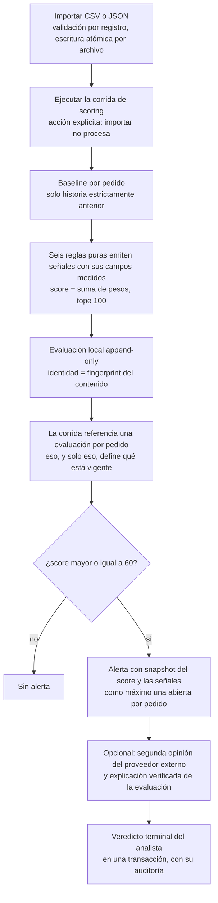
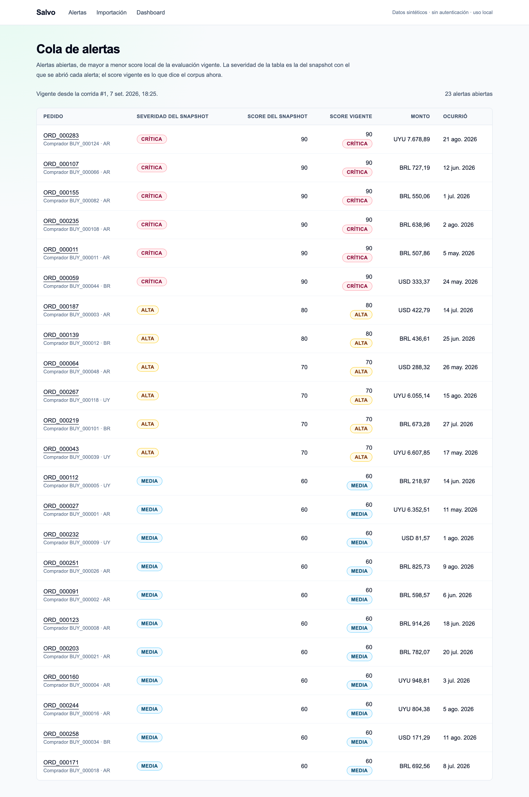
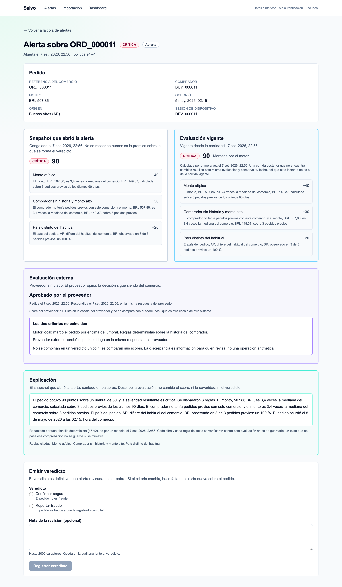
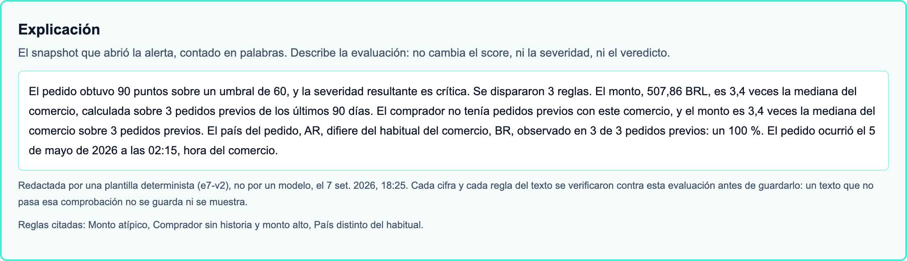
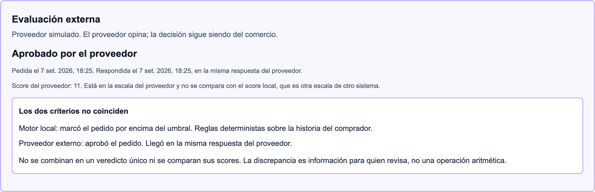
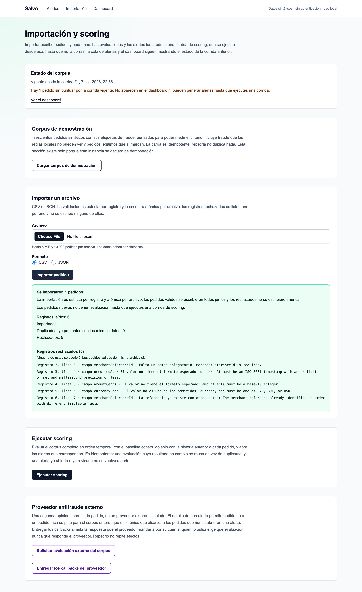
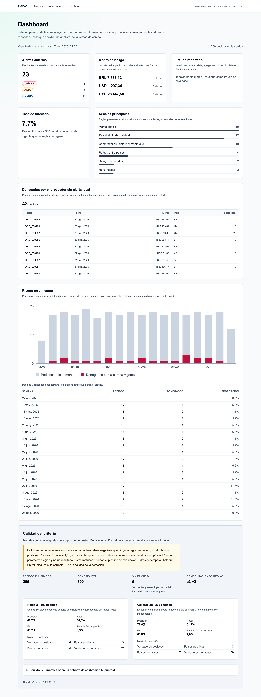
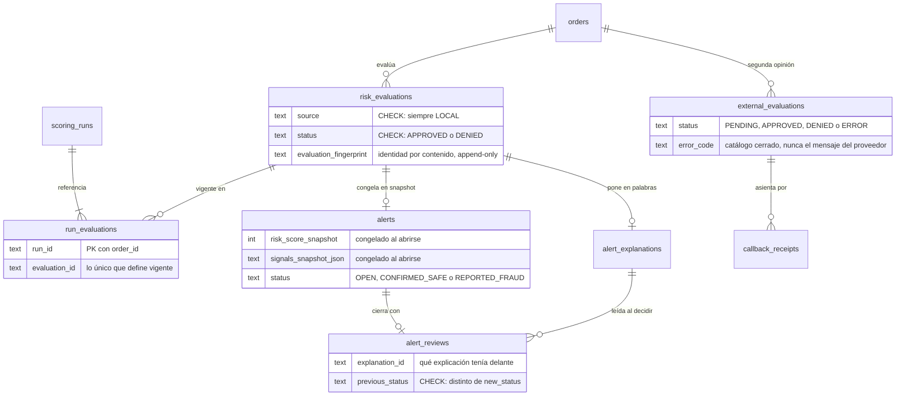
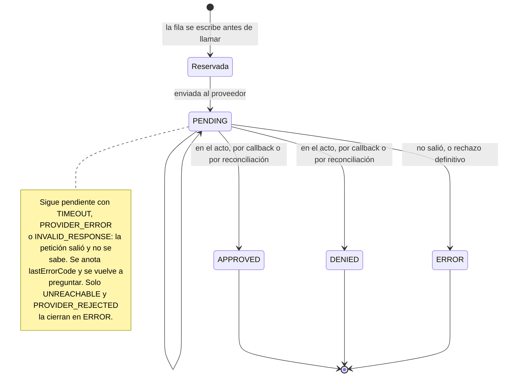
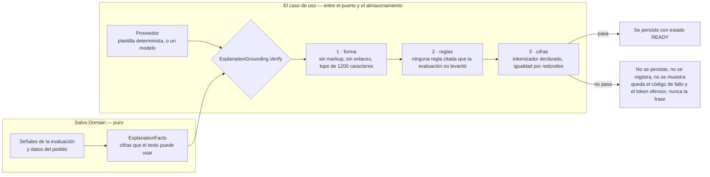

# Salvo

Consola antifraude para el equipo de riesgo de un comercio electrónico. Puntúa pedidos con reglas
deterministas sobre historia estrictamente anterior, abre alertas auditables, pide una segunda
opinión a un proveedor externo simulado y pone la evaluación en palabras verificando el texto antes
de guardarlo.

Es un proyecto de portfolio. Los datos son sintéticos, los proveedores externos son simulaciones en
proceso y no hay ninguna credencial de nadie en ningún lado.

## Qué es y qué no

**Salvo es la consola de un comercio**, no un proveedor antifraude. La diferencia no es de tamaño:
un proveedor evalúa para muchos comercios y ve el fraude a través de toda su base, y esa posición
cambia qué señales existen. Salvo ve lo que ve un comercio —su propio historial de pedidos— y de ahí
salen las seis reglas.

Sí tiene un motor de reglas: seis, deterministas, puras y con la configuración en un solo objeto
inmutable, `backend/src/Salvo.Domain/Risk/RuleConfig.cs`.

| Regla | Peso | Qué mira |
| --- | --- | --- |
| `amount_anomaly` | 40 | El monto contra la mediana del comprador y la del comercio, en 90 días |
| `cross_border_velocity` | 40 | Dos países distintos para el mismo comprador dentro de 2 horas |
| `velocity` | 30 | Ráfaga de pedidos del mismo comprador en 10 minutos |
| `new_buyer_high_value` | 30 | Primer pedido de un comprador, muy por encima de lo habitual del comercio |
| `foreign_country` | 20 | País fuera del habitual del comercio, con el hábito calculado en 90 días |
| `unusual_hour` | 10 | Franja horaria de seis horas que casi no aparece en la historia del comercio |

Los pesos suman hasta un tope de 100. A partir de 60 se abre una alerta, y la banda sale de
`backend/src/Salvo.Domain/Alerts/AlertPolicy.cs`: 60–69 media, 70–89 alta, 90–100 crítica. Ni el
umbral ni las bandas se persisten como resultado; lo que se guarda es la versión de la función que
los produjo, para que una política futura no reclasifique en silencio una alerta que alguien ya
revisó.

Lo que **no** es:

- **No decide nada con un modelo de lenguaje.** La IA solo puede redactar; no puede escribir en
  ninguna superficie de decisión, y el texto que redacta se verifica antes de guardarse.
- **No usa la etiqueta de fraude como señal.** `isFraudLabel` existe únicamente para medir el
  criterio, en una superficie aparte que solo aparece si la instancia se declara de demostración.
- **No habló nunca con Koin**, ni con Anthropic, ni con ningún servicio remoto.

## Simulación, sandbox y producción

Un portfolio que presenta un mock como integración es peor que uno que no integra nada. Este
repositorio no puede hacerlo, y no porque lo prometa en un párrafo.

| Capa | Hoy | Qué haría falta |
| --- | --- | --- |
| Proveedor antifraude | Mock determinista en proceso, sin red | Los ocho requisitos del §5.3 del Blueprint: private key y `org_id`, base URL confirmada, payload de la versión elegida, callback HTTPS accesible, mecanismo oficial de autenticación del callback, device fingerprint, casos sandbox y política de timeout/retry/backoff |
| Redacción de explicaciones | Plantilla determinista en proceso, sin red | Decisión aparte, todavía no tomada |
| Datos | Fixture sintética, compradores pseudónimos | Nada: el proyecto no incorpora datos reales |

El hecho, y no la promesa: **`KOIN_MODE=sandbox` y `AI_PROVIDER=anthropic` hacen fallar el
arranque**, con o sin clave configurada. Están rechazados explícitamente en
`backend/src/Salvo.Infrastructure/DependencyInjection.cs`, con el mensaje que dice por qué. Un valor
desconocido en cualquiera de las dos variables también falla: el modo por defecto es el único que
existe, y elegir otro tiene que ser un error ruidoso y no una degradación silenciosa a mock.

La autenticación del callback es la misma clase de honestidad. Hay un secreto compartido en una
cabecera, `X-Salvo-Callback-Secret`, y el endpoint **falla cerrado**: sin secreto configurado
responde `401` a todo. No es el mecanismo que usaría una integración real —eso sería una firma sobre
el cuerpo— y `backend/src/Salvo.Api/ExternalCallbackEndpoints.cs` lo dice en su propio comentario.
Lo que está modelado es dónde se resuelve el problema, no una solución apta para producción.

## El recorrido de un pedido



Ocho pasos, y el segundo es el que más gente da por sentado: **importar no puntúa**. Escribir
pedidos y evaluarlos son dos acciones separadas, porque una importación que dispara una corrida no
deja elegir cuándo se mueve la línea de base de todo el corpus.

## El recorrido, en seis capturas

Se regeneran con `./scripts/capturas.sh`, sobre una base nueva y sin tocar la de nadie. Qué cambia
entre una regeneración y otra, y el texto alternativo de cada una, están en
[la nota que las acompaña](docs/capturas/README.md).

| | |
| --- | --- |
|  |  |
| **La cola.** Alertas abiertas, de mayor a menor score vigente. La severidad con la que se abrió cada alerta y la que dice el corpus ahora van en columnas separadas: son dos momentos distintos. | **El detalle.** El pedido, el snapshot congelado, la evaluación vigente, la opinión del proveedor, la explicación y el veredicto. Todo lo que hace falta para decidir, en una pantalla. |
|  |  |
| **La explicación.** Cada cifra y cada regla del párrafo se verificaron contra la evaluación antes de guardarlo. El pie dice quién lo escribió y con qué versión de plantilla. | **La divergencia de criterio.** El motor local marcó el pedido; el proveedor lo aprobó. No se combinan en un veredicto único y no se comparan sus scores: son escalas de sistemas distintos. |
|  |  |
| **La importación.** Estricta por registro y atómica por archivo: las filas válidas entran todas juntas y las rechazadas se listan una por una, con su línea y su motivo. | **El dashboard.** Monto en riesgo por moneda, sin sumarlas jamás entre sí, y el gráfico semanal dibujado en SVG por el servidor. Abajo, la calidad del criterio con su advertencia. |

## Las tres fuentes de verdad que nunca se mezclan

El score local, la opinión del proveedor externo y el veredicto del analista son tres cosas
distintas. Mezclarlas es el error de diseño que este modelo existe para no cometer: cada una tiene
su tabla, su ciclo de vida y su regla de escritura.



Tres cosas que este dibujo hace explícitas y que el código impone a nivel de base:

1. **`risk_evaluations` está restringida a `source = 'LOCAL'`** por un `CHECK`. Ningún estado
   externo puede colarse en la tabla del motor local, ni siquiera por error de un caso de uso.
2. **Ninguna lectura de estado vigente consulta `risk_evaluations` a secas.** La tabla acumula
   historia; qué está vigente lo dice `run_evaluations` de la corrida vigente. Si un baseline vuelve
   a un valor anterior, el fingerprint rebota y la fila vieja se reusa: sin la corrida, «la última»
   sería la equivocada.
3. **`alert_reviews.explanation_id` es una clave foránea real.** El registro de una revisión guarda
   qué explicación tenía delante quien decidió, incluso si esa explicación ya no es la vigente.

## Cinco decisiones, con su porqué

Cada una está en la bitácora del Blueprint con su número y su justificación. Estas cinco son las que
más se notan si faltan.

### 29 y 31 — La evaluación es append-only y su identidad es su contenido

Una evaluación local no se actualiza nunca: se escribe una fila nueva, y su identidad es un
fingerprint de lo que contiene. Volver a correr el scoring sobre un corpus que no cambió no escribe
nada, porque las filas ya existen con ese mismo fingerprint.

Eso solo, sin embargo, es una trampa. El baseline de un pedido depende de la historia anterior, y
una importación retroactiva puede hacerlo **volver a un valor que ya tuvo**: 0 → 40 → 0. Con
identidad por contenido, la tercera evaluación es la primera fila otra vez, y «la más reciente» pasa
a ser una fila obsoleta. Por eso la corrida se persiste y referencia una evaluación por pedido:
`ScoringRun` es lo único que define qué está vigente.

Lo afirman `RiskEvaluationIdentityTests.FingerprintIdentifiesContentAndNotTheRow`,
`ScoringRunPersistenceTests.RepeatedRunOverTheSameCorpusAppendsNothingAndReferencesTheSameEvaluations`
y `ScoringRunPersistenceTests.AScoreThatReturnsToAnEarlierValueKeepsTheCurrentEvaluationCorrect`,
que es el rebote 0 → 40 → 0 escrito como test.

### 33 — Una alerta congela su premisa y expone la divergencia

Una alerta abierta guarda un snapshot del score y de las señales que la abrieron, y **no se
actualiza** cuando una corrida posterior cambia la evaluación del pedido. El snapshot es el registro
auditable de por qué alguien tuvo que mirar ese pedido.

Ocultar el cambio sería peor que mostrarlo, así que la divergencia entre el snapshot y la evaluación
vigente se expone en la consola y se reconoce al revisar. Una escalada de banda no reabre nada: abre
una alerta nueva enlazada a la anterior por `supersedesAlertId`. El veredicto es terminal.

`AlertCreationTests.AnOpenAlertKeepsItsSnapshotAndExposesTheDivergenceAfterABackfill` y
`AlertCreationTests.AnEscalationAfterABackfillOpensANewAlertLinkedToTheReviewedOne` lo afirman, y
`AlertReviewTests.TwoConcurrentReviewsLeaveOneVerdictAndExactlyOneAudit` afirma que dos revisiones
simultáneas dejan un veredicto y exactamente una auditoría.

### 37 y 38 — El dashboard operativo no lee la etiqueta de fraude, y se prueba invirtiéndola

En producción la verdad de campo no existe: un comercio conoce el veredicto de su analista, no
cuáles pedidos eran fraude. Un dashboard operativo que se apoye en la etiqueta es un dashboard que
no puede existir fuera de la demo, así que el de Salvo no la lee por ningún camino, ni directo ni
indirecto. La calidad del criterio —precisión, recall, F1— vive en otra superficie, detrás de la
bandera `DemoData:Enabled`.

La parte interesante es **cómo se verifica**. No por reflexión sobre constructores, que no ve un
`JOIN` dentro de una implementación de EF ni una dependencia indirecta:
`DashboardEndpointTests.TheDashboardIsIndependentOfGroundTruth` **invierte todas las etiquetas en la
base** y exige que la respuesta del dashboard sea idéntica byte a byte.

### 45 y 47 — Reservar antes de llamar, y no cerrar por un fallo posterior al envío

La fila de una evaluación externa se reserva y se persiste **antes** de llamar al proveedor. Sin esa
reserva, dos peticiones concurrentes crean dos evaluaciones en el proveedor, y un callback que
llegue antes del commit queda huérfano para siempre.

Y un fallo después del envío no cierra la evaluación. Un timeout es indeterminado: cerrarlo en
`ERROR` descartaría un veredicto que el proveedor está por mandar y duplicaría la evaluación en el
siguiente intento. La taxonomía vive en un solo lugar,
`backend/src/Salvo.Application/External/ExternalProviderExchange.cs`, para que ningún adaptador
decida por su cuenta si un fallo es final.



Ese reparto de los cinco códigos —cuáles dejan la fila viva y cuáles la cierran— es lo único que la
tabla del §4.5 del Blueprint no da, y es la decisión entera.

Un callback se correlaciona por el identificador del proveedor **o** por la referencia del pedido:
la segunda ruta existe porque el recibo que más falta hace es justamente el de la evaluación cuyo
identificador nunca llegó. El recibo y la transición que provoca se persisten en una única unidad de
trabajo, y un duplicado es la ausencia de una segunda fila, detectada por violación de unicidad.

Lo afirman `ExternalEvaluationConcurrencyTests.TwoConcurrentRequestsCallTheProviderOnceAndLeaveOneEvaluation`,
`ExternalEvaluationReconciliationTests.ATimeoutIsResolvedByReconciliationIntoASingleRow`,
`ExternalCallbackRaceTests.ACallbackThatArrivesBeforeTheIdentifierIsWrittenDownStillSettlesTheEvaluation`,
`ExternalCallbackEndpointTests.WithNoSecretConfiguredEveryCallbackIsRefused` y
`ExternalCallbackEndpointTests.DeliveringTheSameCallbackTwiceIsARecordedReplay`.

### 52 y 54 — El grounding se verifica sobre la salida, y al modelo no entra texto ajeno

«Usá solo las señales suministradas» es una intención mientras vive en un prompt y una propiedad
cuando se comprueba a la salida. Salvo comprueba a la salida.



Tres cosas que este dibujo dice y conviene leer despacio:

- **La verificación vive en el caso de uso**, entre el puerto y el almacenamiento, nunca en el
  adaptador. Si viviera en el adaptador, la plantilla determinista pasaría por ser educada y un
  adaptador futuro pasaría porque alguien se acordó. Acá no hay ningún camino a la base que la
  esquive: `backend/src/Salvo.Application/Explanations/RequestExplanationHandler.cs` la llama, y un
  test de mutación quita la llamada y observa cómo un rechazo se convierte en un texto guardado.
- **Los hechos se construyen en el dominio, no leyendo prosa.** Cada regla guarda su medición como
  campos con nombre, y `backend/src/Salvo.Domain/Explanations/ExplanationFacts.cs` arma con ellos,
  con el pedido y con la configuración el conjunto de cifras que una frase correcta puede contener.
  Incluye las que no están en ningún campo porque son otra manera de escribir la misma verdad: el
  monto en unidades y no en centavos, con separador de miles, el porcentaje redondeado, el instante
  en hora del comercio. Quitar cualquiera de esas entradas devuelve un rechazo de texto correcto.
- **El tokenizador es uno solo y está declarado**,
  `backend/src/Salvo.Domain/Explanations/NumberTokenizer.cs`. Corre sobre el resumen que devuelve el
  proveedor, para leer qué afirmó, y fija además con cuántos decimales puede escribirse un hecho sin
  dejar de respaldarlo. Que la tolerancia de redondeo sea una sola es el punto: dos criterios
  discreparían, y la discrepancia aparecería como rechazo de texto correcto.
- **Al input de un modelo no entra ningún texto que no escriba el motor.** Quedan fuera los campos
  importados, los identificadores y las notas escritas por personas. Un identificador normalizado a
  mayúsculas no es seguro por tener formato estricto: admite una instrucción legible en su alfabeto.

Lo afirman `ExplanationGroundingTests.AnInventedFigureIsRefusedAndNoTextIsStored`,
`ExplanationIsolationTests.NoTextTheEngineDidNotWriteReachesTheProvider`,
`ExplanationIsolationTests.ExplainingEveryAlertChangesNoDecisionSurface` y
`ExplanationIsolationTests.InvertingEveryLabelChangesNoSummary`, que invierte todas las etiquetas y
exige que ni una palabra del texto cambie.

## Cómo se verifica

Lo que distingue a este proyecto no es qué hace, sino cómo se sabe que lo hace. Dos compuertas —una
de ellas con un tercer script adentro— y una regla.

```bash
npm ci --prefix frontend
./scripts/check.sh
```

`scripts/check.sh` corre, en este orden: la comprobación de lo que este README afirma, la
comprobación de que los tipos generados desde OpenAPI no derivaron del contrato capturado —las dos
primero, porque son los pasos más baratos y no necesitan ningún proceso escuchando—, el restore
bloqueado de NuGet, el tooling de EF, el build en Release con warnings como errores, la comprobación
de que el modelo EF no tiene cambios de migración pendientes, los tests .NET, y después typecheck,
ESLint, Vitest y el build de producción del frontend.

```bash
./scripts/smoke-ui.sh
```

`scripts/smoke-ui.sh` es lo único que verifica el recorrido de verdad, y por eso no está dentro de la
compuerta: levanta la API y `next start` en puertos propios, sobre bases temporales, y le pide las
rutas a un servidor HTTP real. Cubre cinco rutas —`/`, `/import`, `/alerts`, el detalle de una alerta
y `/dashboard`— en ocho escenarios: con datos, con la evaluación externa pedida y entregada, con la
explicación escrita, con una explicación de una plantilla anterior, con el despliegue en portugués,
con un idioma que este build no habla y por eso no arranca, con la base vacía y con la API apagada.
No toca la base de desarrollo y no borra nada.

```bash
./scripts/check-docs.sh
```

`scripts/check-docs.sh` verifica este archivo: que cada ruta que cita exista, que cada enlace
relativo apunte a algo, y que cada test que nombra exista de verdad en `backend/tests` o en
`frontend/src`. Un documento que afirma cosas sobre un repositorio se desactualiza en silencio, y esa
es exactamente la clase de deriva que un script detecta y una promesa no. Corre solo y también
dentro de la compuerta, que es donde sirve.

Lo que no comprueba, y conviene tener presente al leer un resultado verde: si una afirmación de
comportamiento es cierta. Para eso está el test que la afirma, y la tabla de verificación del
handoff que los enlaza uno por uno.

**Este README no cita ninguna cantidad de tests**, a propósito. Una cantidad es cierta el día que se
escribe; cita los comandos, que siguen siendo ciertos.

Algunos tests que vale la pena leer aunque no se corran:

| Test | Qué afirma |
| --- | --- |
| `TemporalRiskEngineTests.AddingFutureOrdersCannotChangeEarlierAssessments` | Agregar pedidos posteriores no cambia ninguna evaluación anterior: no hay fuga temporal |
| `DashboardEndpointTests.TheDashboardIsIndependentOfGroundTruth` | Invertir todas las etiquetas en la base deja la respuesta del dashboard idéntica |
| `ExplanationIsolationTests.InvertingEveryLabelChangesNoSummary` | Lo mismo, sobre el texto de las explicaciones |
| `ExplanationGroundingTests.AnInventedFigureIsRefusedAndNoTextIsStored` | Una cifra inventada se rechaza y no queda nada escrito |
| `ExternalCallbackRaceTests.ACallbackThatArrivesBeforeTheIdentifierIsWrittenDownStillSettlesTheEvaluation` | El callback que llega antes del commit igual asienta la evaluación |
| `AlertReviewTests.TwoConcurrentReviewsLeaveOneVerdictAndExactlyOneAudit` | Dos revisiones simultáneas dejan un veredicto y una auditoría |
| `DemoSeedTests.SeedIsFullyIdempotentAndContainsOnlySyntheticPseudonymousData` | El seed es idempotente y la fixture no tiene datos personales |
| `OpenApiDriftTests` | El documento OpenAPI capturado no derivó de la API que lo produce |
| `boundary.test.ts` | Ningún componente cliente recibe objetos de la API: solo primitivas |

Y una regla que no es un test: los tests no hacen red. Anthropic y Koin están mockeados, y la caída
de cualquiera de los dos no detiene el scoring local.

## Límites declarados

Un proyecto que dice lo que le falta se lee mejor que uno que finge estar terminado.

**F1 es un parámetro del diseño, no un resultado.** Los veintiocho fraudes de trescientos pedidos no
son la medición de nada: son una tasa base del 9,3 % que alguien eligió al escribir la fixture, junto
con qué pedidos son fraude y cuáles de ellos las reglas no pueden ver. El corpus se construyó **para
que las reglas se equivoquen**, con falsos negativos y falsos positivos puestos a mano, así que la
puntuación de más abajo mide qué tan bien se armó ese ejercicio y no qué tan bien detecta el motor.
Lo que sí prueban las métricas es que la evaluación es honesta: división temporal, holdout sin
retuning y aritmética que cierra. La advertencia está escrita en la propia consola, en
`frontend/src/app/dashboard/quality-section.tsx`, y no en una nota al pie.

**Ninguna cifra de este README está verificada por script.** `scripts/check-docs.sh` comprueba que
cada ruta exista, que cada enlace apunte a algo y que cada test nombrado exista de verdad; de las
cifras no sabe nada. Se comprobó cambiando una por una falsa y viendo que la compuerta entera pasaba
en verde. Así que el bloque de más abajo depende de que alguien lo regenere, y por eso dice de qué
corrida salió y de qué día. Es la parte del documento que envejece sin avisar.

**El contraste de color no lo comprueba nada.** `jsdom` no calcula estilos ni tiene canvas, así que
`axe-core` devuelve `color-contrast` como incompleto en vez de como violación, y la regla está
apagada por su nombre en `frontend/src/test/axe.ts`. Apagada y dicha es honesto; silenciosamente
incompleta no lo es.

**El recorrido con lector de pantalla fue parcial.** Se recorrieron la portada y el encabezado de la
cola de alertas, sin hallazgos, y ahí se interrumpió. Nadie recorrió esta consola entera sin ver la
pantalla, y ningún documento del repositorio dice lo contrario. La pasada automática sí se hizo
entera: treinta y una reglas de accesibilidad en el linter más `axe-core` sobre el árbol renderizado,
las dos dentro de la compuerta.

**El portugués no lo revisó un hablante nativo.** Los dos diccionarios están completos y una clave
faltante es error de compilación, pero la elección de cada palabra es mía.
`frontend/src/lib/i18n/glosario-pt.md` pone las dos versiones lado a lado para que alguien lo corrija
fila por fila sin abrir código.

**`MER_US_MARKET` es hoy el comercio argentino.** El corpus vive en el corredor UTC−3 para que «hora
del comercio» signifique lo mismo en los tres, así que ese comercio factura en dólares con noventa de
sus cien pedidos desde Argentina. El identificador quedó heredado del corpus anterior y **se explica
en vez de arreglarse**: la referencia de un pedido es `(comercio, referencia)`, y renombrar el
comercio anularía el guardián de conflicto que impide que dos corpus contradictorios convivan en la
misma base. El nombre miente; cambiarlo cuesta más de lo que corrige.

**Quedan tres asperezas de idioma en la consola.** El mensaje técnico de un registro rechazado sigue
en inglés, porque nombra el valor rechazado y no lo escribe la consola. El código `UNKNOWN_FIELD`,
que solo emite el parser de JSON, no tiene rótulo traducido y se muestra crudo. Y el aviso de una
importación de un solo pedido dice «Se importaron 1 pedidos».

**`frontend/src/lib/i18n/glosario.mjs` es un generador que vive dentro del árbol de fuentes.** Está
al lado del archivo que produce y de los diccionarios que lee, que es lo cómodo para quien lo corre,
pero `frontend/src/` es código de la consola y esto no lo es. Se deja donde está y se dice.

**Dos cosas que se vieron y no se arreglaron.** El orden de la cola desempata con un identificador
aleatorio, así que dos alertas del mismo score aparecen en cualquier orden entre corridas. Y el panel
de revisión no muestra qué explicación tenía delante quien decidió, aunque la base lo guarde y sea
una clave foránea real.

**No hay autenticación**, y por eso la aplicación es local y no se despliega con rutas mutables.
Tampoco hay observabilidad, ni Postgres, ni consulta en lenguaje natural: están fuera del MVP.
**Anthropic sigue siendo una decisión aparte** y no tiene adaptador: `AI_PROVIDER=anthropic` se niega
a arrancar, a propósito.

<!-- corpus:inicio -->

### El corpus de demostración, en números

Todas las cifras que dependen del corpus viven acá y en ningún otro lugar de este archivo. **Salen de
una corrida del 2026-09-07** sobre una base recién migrada, no de otro documento: `POST
/api/demo-data/seed`, `POST /api/risk-evaluations:run`, y después leer `/api/dashboard`,
`/api/evaluation-metrics` y `/api/alerts`.

| Magnitud | Valor |
| --- | --- |
| Pedidos sintéticos | 300, del 2026-05-01 al 2026-08-28 |
| Comercios | 3, uno por moneda: UYU, BRL y USD, 100 pedidos cada uno |
| Dónde operan | El corredor UTC−3: Uruguay, Brasil y Argentina |
| Etiquetas de fraude | 28 fraudes y 272 legítimos: una tasa base del 9,3 %, elegida al construir la fixture |
| Evaluaciones de la corrida | 300 con `e3-v2`, todas con fingerprint distinto; 56 levantan al menos una señal |
| Alertas abiertas | 23: 11 media, 6 alta y 6 crítica. Las tres bandas existen |
| Tasa de marcado | 7,7 % |
| Monto en riesgo | 2.844.758 centavos UYU en 6 alertas, 756.612 BRL en 12 y 129.734 USD en 5 |
| Reglas que disparan | Las seis. Sobre las 300 evaluaciones: `foreign_country` 50, `amount_anomaly` 19, `new_buyer_high_value` 10, `cross_border_velocity` 4, `velocity` 2 y `unusual_hour` 2 |
| Calibración y holdout | 200 pedidos de calibración y 100 de holdout, división temporal |
| Umbral elegido | 60, que es además el que maximiza F1 en el barrido de calibración |
| Evaluación externa del corpus | 300 pedidos: 279 se asientan en el acto y 21 quedan pendientes de callback |
| Tras entregar los callbacks | 237 aprobadas, 54 denegadas y 9 en error: 6 rechazadas por el proveedor y 3 que nunca salieron |
| Denegados por el proveedor sin alerta local | 43 con las 279 síncronas; 51 después de entregar los 21 callbacks |

La calidad del criterio va con sus conteos y su `n`, y no como una razón con dos decimales, porque
las cohortes son chicas y una razón sola esconde cuánto pesa cada caso:

| Cohorte | n | Verdaderos positivos | Falsos positivos | Falsos negativos | Verdaderos negativos | Precisión | Recall | F1 |
| --- | --- | --- | --- | --- | --- | --- | --- | --- |
| Calibración, umbral 60 | 200 | 11 | 3 | 7 | 179 | 11 de 14 | 11 de 18 | 0,688 |
| Holdout, umbral 60 | 100 | 6 | 3 | 4 | 87 | 6 de 9 | 6 de 10 | 0,632 |

El holdout tiene **diez** pedidos fraudulentos, así que un falso negativo más movería el recall diez
puntos de golpe. Con cohortes de este tamaño, la tercera cifra decimal de un F1 no significa nada, y
la matriz sí.

Las bandas del proveedor simulado no son cifras del corpus sino de su función: el resultado depende
de los dígitos finales de la referencia del pedido, módulo cien, y está documentado en
`backend/src/Salvo.Infrastructure/External/MockAntifraudProvider.cs`. Un hash uniforme habría dejado
un cuarto del corpus pendiente, que son doscientas y pico de confirmaciones manuales antes de que
termine una demo.

<!-- corpus:fin -->

## Cómo correrlo

Con .NET 10.0.400, Node.js 24.20.0 y npm 11.19.0 en `PATH`. Hacen falta **tres terminales**: las dos
primeras quedan ocupadas mientras los procesos corren.

**Terminal A — la API**, en `http://127.0.0.1:5100`:

```bash
cd backend/src/Salvo.Api
dotnet run
```

Esperar `Now listening on: http://127.0.0.1:5100`. Si responde *address already in use*, hay otra
instancia viva: `kill $(lsof -ti tcp:5100)` y repetir.

**Terminal B — la consola**, en `http://localhost:3000`:

```bash
npm run dev --prefix frontend
```

**Terminal C — libre**, para `curl`, git y todo lo demás.

Después, en el navegador:

| Ruta | Qué muestra |
| --- | --- |
| `http://localhost:3000/import` | Cargar el corpus demo o importar un archivo, ejecutar la corrida de scoring, pedir la evaluación externa del corpus entero y entregar sus callbacks |
| `http://localhost:3000/alerts` | Cola de alertas abiertas, de mayor a menor score vigente |
| `http://localhost:3000/dashboard` | Estado operativo de la corrida vigente, y la calidad del criterio con su advertencia |

**La primera vez, o sobre una base vacía, el orden importa**: cargar el corpus demo y ejecutar la
corrida desde `/import`. Sin corrida no hay evaluaciones ni alertas, y el feed y el dashboard lo
dicen explícitamente.

`dotnet run` usa el entorno `Development`, donde `DemoData:Enabled` es `true`. Esa única bandera
enciende el botón de carga demo, los dos botones del proveedor externo y la sección de calidad del
criterio; sin ella, la API ni siquiera registra esas rutas y la consola pregunta antes de ofrecer
los botones.

Para poblar la base sin la interfaz:

```bash
curl -s -X POST http://127.0.0.1:5100/api/demo-data/seed
curl -s -X POST http://127.0.0.1:5100/api/risk-evaluations:run
```

La importación acepta CSV y JSON, hasta 5 MiB y 10.000 registros por archivo, con validación
estricta por registro y escritura atómica por documento: los rechazados se listan uno por uno —hasta
mil con detalle— y no se escribe ninguno de ellos.

Las variables de entorno están en `.env.example`, con sus valores seguros y sin un solo secreto.
Ninguna clave usa prefijo `NEXT_PUBLIC_`, y el proceso de Next nunca lee el secreto del callback.

Para probar la importación sin inventarse un archivo, hay cuatro muestras sintéticas en
[`docs/muestras/`](docs/muestras/README.md): la válida, la que trae un error de cada tipo, la de
formato JSON con el caso de hora inusual, y la que rechaza el documento entero.

### Ensayar la demo

```bash
./scripts/demo.sh
```

Levanta la API y la consola sobre una **base nueva con la fecha en el nombre**, con el corpus
cargado y la corrida ya ejecutada, y se queda en pie hasta el Ctrl-C. Existe porque el recorrido de
[`docs/guion-demo.md`](docs/guion-demo.md) es destructivo por diseño —el veredicto es terminal, una
explicación escrita no se regenera y el seed es idempotente—, así que cada ensayo consume el estado
del anterior. **No borra nada**: la base del ensayo anterior queda donde estaba.

### Regenerar las capturas

```bash
./scripts/capturas.sh
```

Usa una base temporal propia, prepara por API el estado de cada toma y fotografía con Playwright,
que vive en `tools/capturas/` con su propio lockfile: `frontend/package-lock.json`, `npm ci` y la
compuerta no cambian. **La primera vez descarga el Chromium que fija esa versión**, del orden de
240 MB entre el navegador y su shell headless, una sola vez por máquina y como paso explícito del
script. Sobrescribe las seis capturas y no borra ninguna.

## Arquitectura

Backend monolítico modular en ASP.NET Core 10, C# 14 y EF Core/SQLite; consola en Next.js con React
y TypeScript estricto. OpenAPI gobierna el contrato entre los dos.

| Proyecto | Qué contiene |
| --- | --- |
| `backend/src/Salvo.Domain` | Entidades, reglas, scoring, métricas y los hechos del grounding. Puro: no referencia ASP.NET Core, EF Core ni ningún SDK |
| `backend/src/Salvo.Application` | Casos de uso, puertos y contratos internos. Acá vive la verificación del grounding y la taxonomía de fallo del proveedor |
| `backend/src/Salvo.Infrastructure` | EF Core, repositorios, la fixture y los adaptadores mock |
| `backend/src/Salvo.Api` | Endpoints, validación de transporte, OpenAPI y composición |
| `frontend/src` | Consola Next.js y cliente HTTP tipado desde el contrato |

Dos puertos separan lo externo de lo propio: `IAntifraudProvider` para la segunda opinión e
`IExplanationProvider` para la redacción. Ningún tipo de cliente HTTP y ningún error de un proveedor
concreto los atraviesa. La consola no contiene reglas de fraude ni toca la base, sus rutas de datos
son dinámicas —el build pasa con la API apagada— y ningún componente cliente recibe objetos de la
API: las guardas de `frontend/src/lib/api/guards.ts` proyectan a primitivas, y `boundary.test.ts` lo
exige.

## Mapa de documentación

| Documento | Propósito |
| --- | --- |
| [Blueprint](DesignAgent/Salvo-Blueprint.md) | Fuente de verdad: alcance, arquitectura, modelo, etapas y la bitácora de decisiones numeradas |
| [Seguimiento](DesignAgent/Salvo-Progress.md) | Estado vivo, checklists por etapa, compuertas y evidencias |
| [Resumen ejecutivo](DesignAgent/Salvo-Overview.md) | Visión rápida del MVP |
| [Mapa de contenido](DesignAgent/Salvo-MOC.md) | Navegación de toda la documentación |
| [Guía de arranque](DesignAgent/Salvo-Getting-Started.md) | Entorno, comandos y forma de trabajo |
| [Portabilidad](DesignAgent/Salvo-Portability.md) | Los puntos de sustitución: agente, proveedor de IA y proveedor antifraude |
| [Instrucciones de proyecto](DesignAgent/Salvo-Project-Instructions.md) | Contexto para una sala de diseño con el repositorio conectado |
| [Reglas de implementación](AGENTS.md) | Reglas permanentes: rige a los dos agentes, porque `CLAUDE.md` lo importa |
| [Kit para Claude](ClaudeAgent/README.md) | Workflow, plantillas y tooling de Claude Code |
| [Política de modelo](ClaudeAgent/Claude-Model-Policy.md) | Qué modelo y qué esfuerzo para cada tipo de tarea |
| [Coordinación](Coordination/README.md) | Trabajo paralelo, ownership y handoffs |
| [Workboard](Coordination/Workboard.md) | Tareas, estados y paths reservados |
| [Diseños y revisiones](Coordination/Tasks/) | El diseño de cada etapa, su revisión adversarial y el brief de cada tarea |
| [Handoffs](Coordination/Handoffs/) | La entrega de cada tarea, con sus comandos y **la tabla de falsación de cada test** |
| [Plantilla de tarea](Coordination/Task-Brief-Template.md) | Resultado, alcance, permisos y verificación de una tarea |
| [Guion de demo](docs/guion-demo.md) | Diez minutos con lo que hay que decir, el clic que hay que dar y qué hacer si algo falla |
| [Nota de las capturas](docs/capturas/README.md) | Cómo se regeneran y qué cambia entre una regeneración y otra |
| [Muestras de importación](docs/muestras/README.md) | Cuatro archivos sintéticos: el válido, el rechazado, el de hora inusual y el de raíz inválida |

Si hay que leer solo dos cosas: la **bitácora del Blueprint**, que es cada decisión con su porqué en
una línea, y los **handoffs**, donde cada test que se escribió viene con la falsación que demuestra
que puede fallar. Un test que nunca se vio fallar no prueba nada, y esa es la parte del proyecto que
menos se ve desde afuera.
